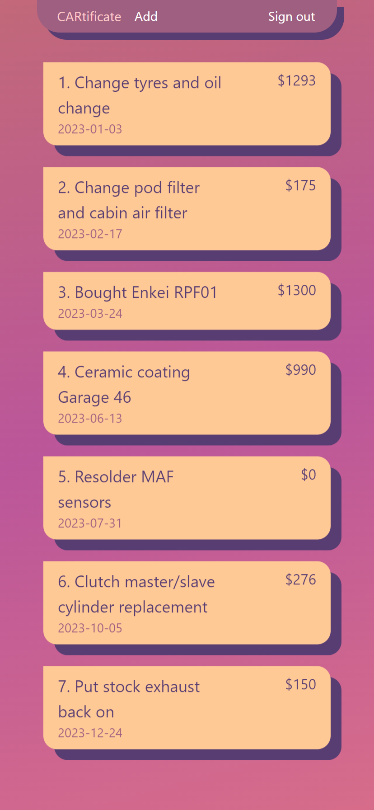
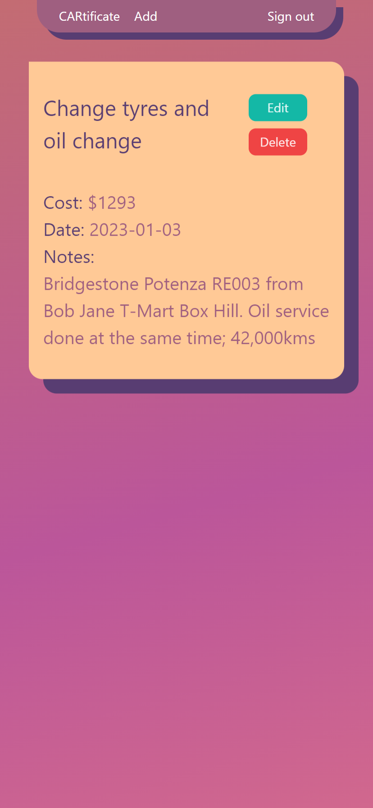
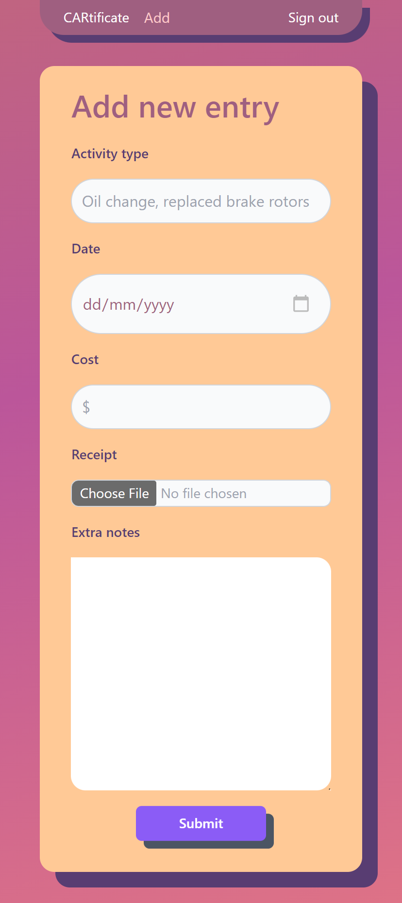
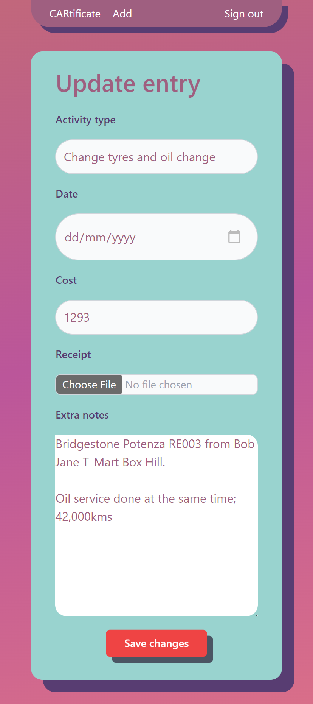

# CARtificate

Selling your car is bittersweet. On the one hand, that means you're probably getting something newer and shinier than the one sitting out front. On the other hand, you have to spend an hour trying to find that manila folder full of receipts that you kept over the years detailing the maintenance records of your car.

You don't want to do it, but you know you could tack on an extra 10% to your asking price if you had that folder.

There's where CARtificate comes in. A light weight web app that lets you log your activity on the go.

Type in your activity, the cost and any extra notes and submit and you're done! You now have an easy to find, easy to read diary of what you've done to your cars over the years.

### How to use

Register an account using a username and a password and start adding in your maintenance records, easy as that!

### Things to come

- Add image functionality to upload receipts
- Add a few more animations
- Deploy (almost there!)

### Notes
This started as a practice project and as such was built only to run locally at first. Almost ready to deploy (updated: 25/03/2024)

### Screenshots

#### Notes to self during the build:
- Was it best practices to filter after receiving the full stack of data from the back end? Should I have filtered this from the front end?
- Was my implementation of log in and log out considered lazy?
- Should bearer token always be sent with each API request?
- .env file should always be in the root directory (spent 30 mins trying to figure out why that didn't work on a new device)
- Add Router to wrap App component in main.jsx
- Add AnimatePresence to wrap all Route components in App.jsx

