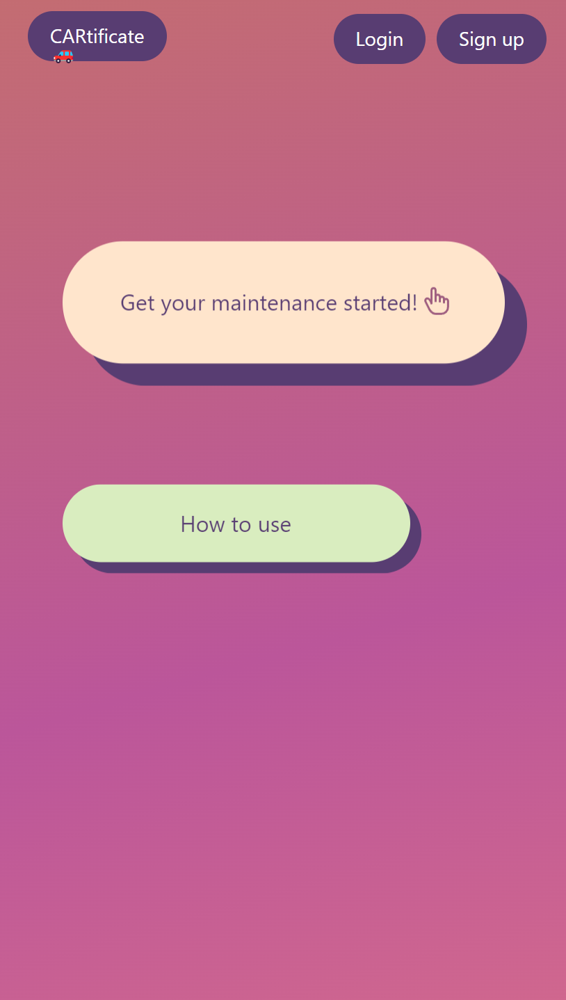
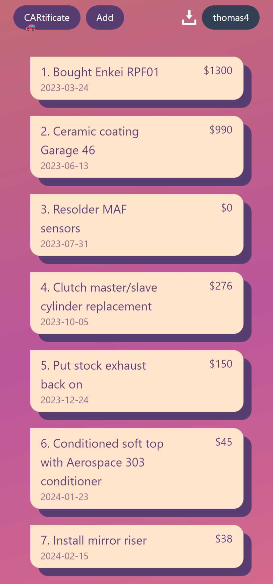
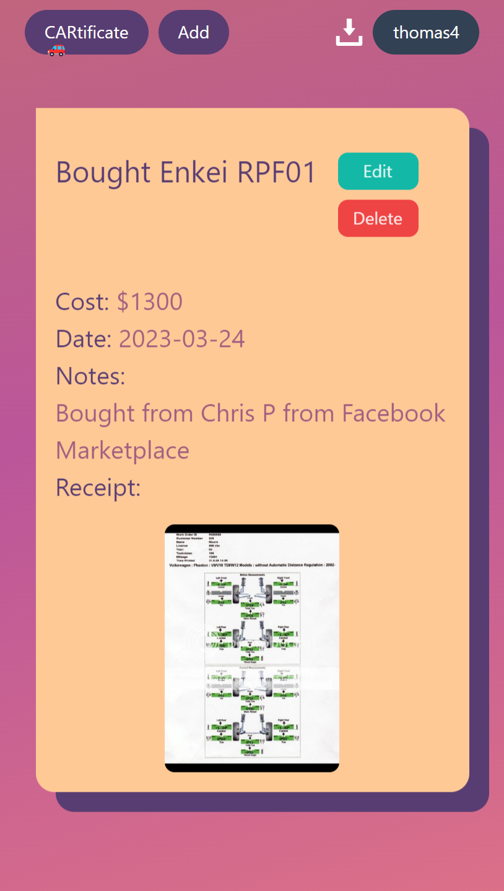
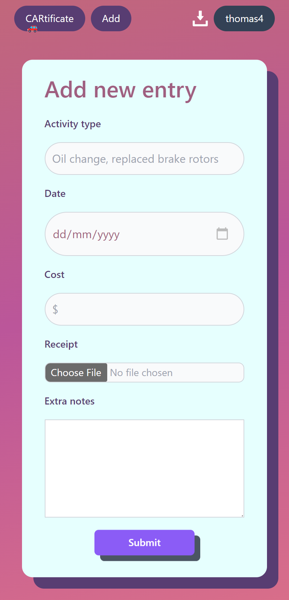
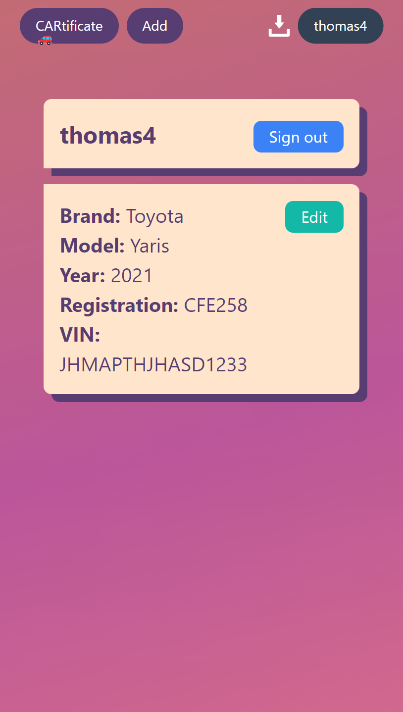

# CARtificate

You can find the deployed app [here](https://cartificate.vercel.app/)

**Please note I haven't paid for Render for the back end and hence it may take up to 30 seconds to spin back up*

Selling your car is bittersweet. On the one hand, that means you're probably getting something newer and shinier than the one sitting out front. On the other hand, you have to spend an hour trying to find that manila folder full of receipts that you kept over the years detailing the maintenance records of your car.

There's where CARtificate comes in. A light weight web app that lets you log your activity on the go.

Type in your activity, the cost and any extra notes, upload a photo of your receipt and submit and you're done! You now have an easy to find, easy to read diary of what you've done to your car over the years.

### How to use

Register an account using a username and a password and start adding in your maintenance records, easy as that!

### Features
- Create your own profile
- Add your vehicle details to your profile so you never forget
- Add/update/delete maintenance records
- Upload a photo of your receipt (supports direct mobile camera upload)
- Download your entries to an Excel file

### Tech Stack

- HTML, CSS, JavaScript, React, Express, NodeJS, MongoDB
- Tailwind CSS, Framer-motion, React router dom

## Deployment

- Front end: Vercel
- Back end: Render

### Screenshots

