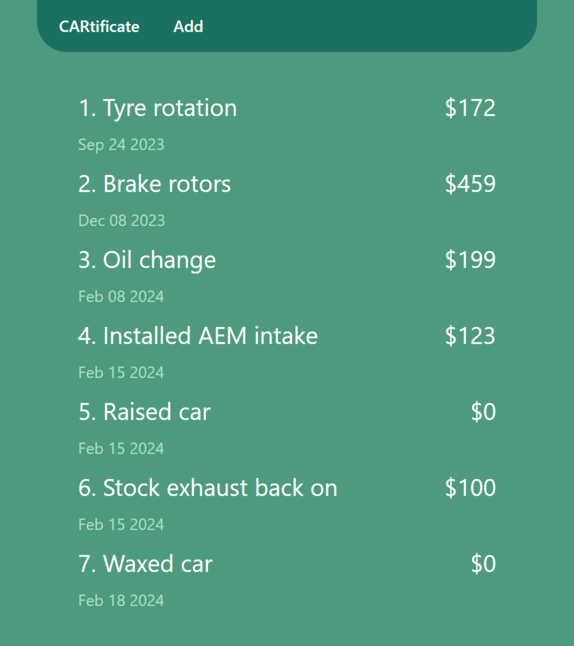
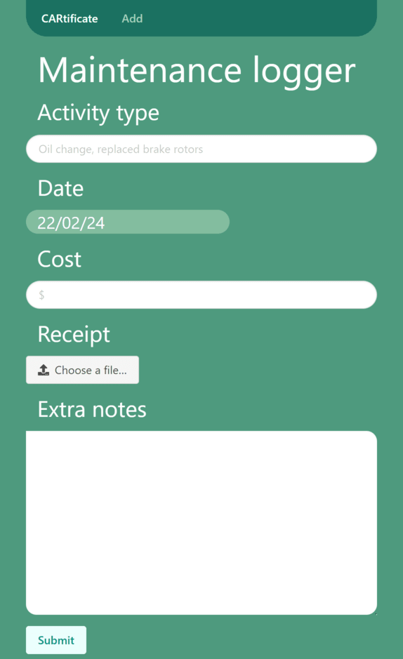

# CARtificate

Selling your car is bittersweet. On the one hand, that means you're probably getting something newer and shinier than the one sitting out front. On the other hand, you have to spend an hour trying to find that manila folder full of receipts that you kept over the years detailing the maintenance records of your car.

You don't want to do it, but you know you could tack on an extra 10% to your asking price if you had that folder.

There's where CARtificate comes in. A light weight web app that lets you log your activity on the go.

Type in your activity, the cost and any extra notes and submit and you're done! You now have an easy to find, easy to read diary of what you've done to your cars over the years.

### Things to come
- Add edit existing records
- Add image functionality to upload receipts

### Screenshots

